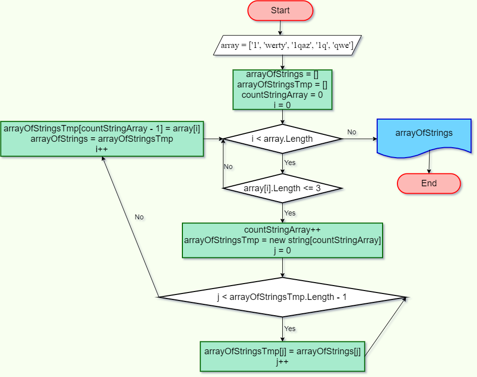

# **Задача итоговой проверочной работы по итогам I четверти обучения на факультете Разработчик в GeekBrains**

## Задача

Написать программу, которая из имеющнгося массива строк формирует массив из строк, длина которых меньше либо равна 3 символа. Первоначальный массив можно ввести с клавиатуры, либо задать на старте выполнения алгоритма. При решении не рекомендуется пользоваться коллекциями, лучше обойтись исключительно массивами.

[Задача на сайте GB](https://gbcdn.mrgcdn.ru/uploads/asset/4283449/attachment/1251e74b703108ee483caaa98787097d.png "GeekBrains")
***

## Решение задачи

Ввод массива строк с клавиатуры организован в цикле, прерывающемся при введении пустой строки.

В связи необходимостью задания размерности массива при его создании (невозможности создания динамического массива), для хранения промежуточных результатов и поэтапного увеличения ёмкости массива используется временный массив arrayOfStringsTemp.

        string[] EntersArrayOfStrings()
    {
        string[] arrayOfStrings = new string[0];
        string[] arrayOfStringsTemp = new string[0];
        string str = "";
        int countStringsArray = 0;
        Console.WriteLine("Введите строки. Для прекращения - введите пустую строку");
        do
        {
            str = Console.ReadLine();
            if (str != "")
            {
                countStringsArray++;
                arrayOfStringsTemp = new string[countStringsArray];
                for (int i = 0; i < arrayOfStringsTemp.Length - 1; i++)
                    arrayOfStringsTemp[i] = arrayOfStrings[i];
                arrayOfStringsTemp[countStringsArray - 1] = str;
                arrayOfStrings = arrayOfStringsTemp;
            }
        } while (str != "");
        return arrayOfStrings;
    }

Для решения основной задачи разработан алгоритм, представленный ниже:

В основе решения:
1. Поэлементный перебор заданного массива (array) в цикле.
    
        for (int i = 0; i < array.Length; i++)

2. Сравнение размера каждого из элементов (array[i].Length, каждой строки массива строк) со значением, данным в задаче (3).
    
        if (array[i].Length <= 3)

3. Заполнение вновь созданного массива arrayOfStrings элементами заданного массива при условии выполнения п.2. (через промежуточный массив arrayOfStringsTemp).

В результате, метод выглядит следующим образом:

        string[] ArrayOfStringsTreeSymb(string[] array)
        {
            string[] arrayOfStrings = new string[0];
            string[] arrayOfStringsTemp = new string[0];
            int countStringsArray = 0;
            for (int i = 0; i < array.Length; i++)
            {
                if (array[i].Length <= 3)
                {
                    countStringsArray++;
                    arrayOfStringsTemp = new string[countStringsArray];
                    for (int j = 0; j < arrayOfStringsTemp.Length - 1; j++)
                        arrayOfStringsTemp[j] = arrayOfStrings[j];
                    arrayOfStringsTemp[countStringsArray - 1] = array[i];
                    arrayOfStrings = arrayOfStringsTemp;
                }
            }
            return arrayOfStrings;
        }